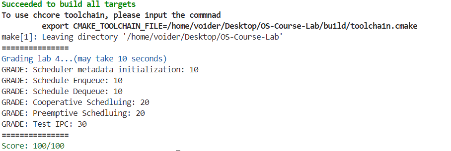
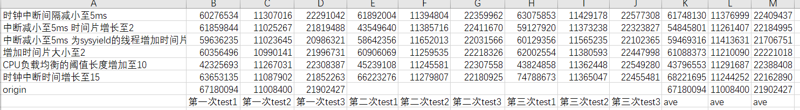

思考题1:  阅读汇编代码kernel/arch/aarch64/boot/raspi3/init/start.S。说明ChCore是如何选定主CPU，并阻塞其他其他CPU的执行的 
  
寄存器mpidr_el1传入寄存器x8中，mpidr_el1存放cpuid，将x8与0xFF & 操作，获取当前CPUid，如果是0号(即主CPU)，则跳转至primary；
如果不是0号，则会在运行至wait_until_smp_enabled之后一直循环，实现阻塞效果，直到主CPU初始化完成，正确设置secondary_boot_flag，其它核跳出循环，执行secondary_init_c，进入初始化阶段
```asm
        mrs	x8, mpidr_el1
        and	x8, x8,	#0xFF
        cbz	x8, primary
wait_for_bss_clear:
	adr	x0, clear_bss_flag
	ldr	x1, [x0]
	cmp     x1, #0
	bne	wait_for_bss_clear

	/* Set cntkctl_el1 to enable cntvct_el0.
         * Enable it when you need to get current tick
         * at EL0, e.g. Running aarch64 ROS2 demos
	mov	x10, 0b11
	msr	cntkctl_el1, x10 */

	/* Turn to el1 from other exception levels. */
	bl 	arm64_elX_to_el1

	/* Prepare stack pointer and jump to C. */
	mov	x1, #INIT_STACK_SIZE
	mul	x1, x8, x1
	adr 	x0, boot_cpu_stack
	add	x0, x0, x1
	add	x0, x0, #INIT_STACK_SIZE
	mov	sp, x0

wait_until_smp_enabled:
	/* CPU ID should be stored in x8 from the first line */
	mov	x1, #8
	mul	x2, x8, x1
	ldr	x1, =secondary_boot_flag
	add	x1, x1, x2
	ldr	x3, [x1]
	cbz	x3, wait_until_smp_enabled

	/* Set CPU id */
	mov	x0, x8
	b 	secondary_init_c

	/* Should never be here */
	b	.
```

思考题2: 阅读汇编代码kernel/arch/aarch64/boot/raspi3/init/start.S, init_c.c以及kernel/arch/aarch64/main.c，解释用于阻塞其他CPU核心的secondary_boot_flag是物理地址还是虚拟地址？是如何传入函数enable_smp_cores中，又是如何赋值的（考虑虚拟地址/物理地址）？
1. 物理地址，secondary_boot_flag定义在init_c.c中，在引导时进入的是init段(低地址) / 同时观察函数：secondary_init_c 在此处其它核开启页表，在跳出阻塞之后才执行，这同样说明阻塞时其它核的页表并没有开启，因此使用的是物理地址
2.CPU0执行 main函数的参数中paddr_t boot_flag 即为smp的boot_flag地址，是物理地址，main函数调用enable_smp_cores(paddr_t boot_flag)将参数传入； 如何赋值：由于CPU0启用了页表，调用phys_to_virt将boot_flag转为虚拟地址，放入对应的内存中
```c
void secondary_init_c(int cpuid)
{
	el1_mmu_activate();
	secondary_cpu_boot(cpuid);
}

wait_until_smp_enabled:
	/* CPU ID should be stored in x8 from the first line */
	mov	x1, #8
	mul	x2, x8, x1
	ldr	x1, =secondary_boot_flag
	add	x1, x1, x2
	ldr	x3, [x1]
	cbz	x3, wait_until_smp_enabled

	/* Set CPU id */
	mov	x0, x8
	b 	secondary_init_c

	/* Should never be here */
	b	.

void main(paddr_t boot_flag, void *info)

void enable_smp_cores(paddr_t boot_flag)
{
	int i = 0;
	long *secondary_boot_flag;

	/* Set current cpu status */
	cpu_status[smp_get_cpu_id()] = cpu_run;
	secondary_boot_flag = (long *)phys_to_virt(boot_flag);
	for (i = 0; i < PLAT_CPU_NUM; i++) {
		secondary_boot_flag[i] = 1;
		flush_dcache_area((u64) secondary_boot_flag,
				  (u64) sizeof(u64) * PLAT_CPU_NUM);
		asm volatile ("dsb sy");
		while (cpu_status[i] == cpu_hang)
		;
		kinfo("CPU %d is active\n", i);
	}
	/* wait all cpu to boot */
	kinfo("All %d CPUs are active\n", PLAT_CPU_NUM);
	init_ipi_data();
}
```

练习 1：在 kernel/sched/policy_rr.c 中完善 rr_sched_init 函数，对 rr_ready_queue_meta 进行初始化。在完成填写之后，你可以看到输出“Scheduler metadata is successfully initialized!”并通过 Scheduler metadata initialization 测试点。

 对每个CPU核心初始化队列和队列锁
```c
int rr_sched_init(void)
{
        /* LAB 4 TODO BEGIN (exercise 1) */
        /* Initial the ready queues (rr_ready_queue_meta) for each CPU core */
        for (int i = 0; i < PLAT_CPU_NUM; ++i) {
                init_list_head(&rr_ready_queue_meta[i].queue_head);
                rr_ready_queue_meta[i].queue_len = 0;
                lock_init(&rr_ready_queue_meta[i].queue_lock);
        }
        /* LAB 4 TODO END (exercise 1) */

        test_scheduler_meta();
        return 0;
}
```

练习 2：在 kernel/sched/policy_rr.c 中完善 __rr_sched_enqueue 函数，将thread插入到cpuid对应的就绪队列中。在完成填写之后，你可以看到输出“Successfully enqueue root thread”并通过 Schedule Enqueue 测试点。

通过list_append将节点加入对应cpu队列，同时更新长度
```c
int __rr_sched_enqueue(struct thread *thread, int cpuid)
{
        /* Already in the ready queue */
        if (thread->thread_ctx->state == TS_READY) {
                return -EINVAL;
        }
        thread->thread_ctx->cpuid = cpuid;
        thread->thread_ctx->state = TS_READY;
        obj_ref(thread);

        /* LAB 4 TODO BEGIN (exercise 2) */
        /* Insert thread into the ready queue of cpuid and update queue length */
        /* Note: you should add two lines of code. */
        list_append(&thread->ready_queue_node, &rr_ready_queue_meta[cpuid].queue_head);
        rr_ready_queue_meta[cpuid].queue_len += 1;
        /* LAB 4 TODO END (exercise 2) */

        return 0;
}
```

练习 3：在 kernel/sched/sched.c 中完善 find_runnable_thread 函数，在就绪队列中找到第一个满足运行条件的线程并返回。 在 kernel/sched/policy_rr.c 中完善 __rr_sched_dequeue 函数，将被选中的线程从就绪队列中移除。在完成填写之后，运行 ChCore 将可以成功进入用户态，你可以看到输出“Enter Procmgr Root thread (userspace)”并通过 Schedule Enqueue 测试点。

根据提示，遍历线程列表，如果线程没有被阻塞，且对应内核栈空闲或者线程为当前线程，即为选中的可以运行的线程。

在列表中删除节点，更新队列长度。
```c
        for_each_in_list (
                thread, struct thread, ready_queue_node, thread_list) {
                if (!thread->thread_ctx->is_suspended && 
                (thread->thread_ctx->kernel_stack_state == KS_FREE
                || thread == current_thread)) {
                        return thread;
                }
        }

        /* LAB 4 TODO BEGIN (exercise 3) */
        /* Delete thread from the ready queue and upate the queue length */
        /* Note: you should add two lines of code. */
        list_del(&thread->ready_queue_node);
        rr_ready_queue_meta[thread->thread_ctx->cpuid].queue_len -= 1;
        /* LAB 4 TODO END (exercise 3) */
```

练习 4：在kernel/sched/sched.c中完善系统调用sys_yield，使用户态程序可以主动让出CPU核心触发线程调度。 此外，请在kernel/sched/policy_rr.c 中完善rr_sched函数，将当前运行的线程重新加入调度队列中。在完成填写之后，运行 ChCore 将可以成功进入用户态并创建两个线程交替执行，你可以看到输出“Cooperative Schedluing Test Done!”并通过 Cooperative Schedluing 测试点。

sys_yield中触发调度函数
rr_shed中将线程重新加入队列

```c
void sys_yield(void)
{
        current_thread->thread_ctx->sc->budget = 0;
        /* LAB 4 TODO BEGIN (exercise 4) */
        /* Trigger sched */
        /* Note: you should just add a function call (one line of code) */
        sched();
        /* LAB 4 TODO END (exercise 4) */
        eret_to_thread(switch_context());
}

            /* LAB 4 TODO BEGIN (exercise 4) */
            /* Enqueue current running thread */
            /* Note: you should just add a function call (one line of code) */
            rr_sched_enqueue(old);                /* LAB 4 TODO END (exercise 4) */
```

练习 5：请根据代码中的注释在kernel/arch/aarch64/plat/raspi3/irq/timer.c中完善plat_timer_init函数，初始化物理时钟。需要完成的步骤有：

    1. 读取 CNTFRQ_EL0 寄存器，为全局变量 cntp_freq 赋值。
    2. 根据 TICK_MS（由ChCore决定的时钟中断的时间间隔，以ms为单位，ChCore默认每10ms触发一次时钟中断）和
    cntfrq_el0 （即物理时钟的频率）计算每两次时钟中断之间 system count 的增长量，
    将其赋值给 cntp_tval 全局变量，并将 cntp_tval 写入 CNTP_TVAL_EL0 寄存器！
    3. 根据上述说明配置控制寄存器CNTP_CTL_EL0。
由于启用了时钟中断，但目前还没有对中断进行处理，所以会影响评分脚本的评分，你可以通过运行ChCore观察是否有"[TEST] Physical Timer was successfully initialized!: OK"输出来判断是否正确对物理时钟进行初始化。

说明见汉字注释
```c
void plat_timer_init(void)
{
	u64 timer_ctl = 0;
	u32 cpuid = smp_get_cpu_id();

	/* Since QEMU only emulate the generic timer, we use the generic timer here */
	asm volatile ("mrs %0, cntpct_el0":"=r" (cntp_init));
	kdebug("timer init cntpct_el0 = %lu\n", cntp_init);

	/* LAB 4 TODO BEGIN (exercise 5) */
	/* Note: you should add three lines of code. */
	/* Read system register cntfrq_el0 to cntp_freq*/
	asm volatile ("mrs %0, cntfrq_el0":"=r" (cntp_freq));   
    # 从cntfrq_el0读值到cntp_freq变量

	/* Calculate the cntp_tval based on TICK_MS and cntp_freq */
	cntp_tval = (cntp_freq * TICK_MS / 1000);
    # 计算两次时钟中断之间 system count 的增长量，赋值给cntp_tval

	/* Write cntp_tval to the system register cntp_tval_el0 */
	asm volatile ("msr cntp_tval_el0, %0"::"r" (cntp_tval));
    # 将cntp_tval写入cntp_tval_el0寄存器

	/* LAB 4 TODO END (exercise 5) */


	tick_per_us = cntp_freq / 1000 / 1000;
	/* Enable CNTPNSIRQ and CNTVIRQ */
	put32(core_timer_irqcntl[cpuid], INT_SRC_TIMER1 | INT_SRC_TIMER3);

	/* LAB 4 TODO BEGIN (exercise 5) */
	/* Note: you should add two lines of code. */
	/* Calculate the value of timer_ctl */
	timer_ctl = 0 << 1 | 1;
	/* Write timer_ctl to the control register (cntp_ctl_el0) */
	asm volatile ("msr cntp_ctl_el0, %0"::"r" (timer_ctl));
    # 开启时钟中断 将对应的bit写入cntp_ctl_el0
	/* LAB 4 TODO END (exercise 5) */

	test_timer_init();
	return;
}
```

练习 6：请在kernel/arch/aarch64/plat/raspi3/irq/irq.c中完善plat_handle_irq函数，当中断号irq为INT_SRC_TIMER1（代表中断源为物理时钟）时调用handle_timer_irq并返回。 请在kernel/irq/irq.c中完善handle_timer_irq函数，递减当前运行线程的时间片budget，并调用sched函数触发调度。 请在kernel/sched/policy_rr.c中完善rr_sched函数，在将当前运行线程重新加入就绪队列之前，恢复其调度时间片budget为DEFAULT_BUDGET。 在完成填写之后，运行 ChCore 将可以成功进入用户态并打断创建的“自旋线程”让内核和主线程可以拿回CPU核心的控制权，你可以看到输出"Hello, I am thread 3. I'm spinning."和“Thread 1 successfully regains the control!”并通过 Preemptive Scheduling 测试点。

case时钟中断，调用中断处理函数并返回
如果当前线程不为空则减少时间片，然后触发一次调度

```c
/* LAB 4 TODO BEGIN (exercise 6) */
/* Call handle_timer_irq and return if irq equals INT_SRC_TIMER1 (physical timer) */
case INT_SRC_TIMER1:
	handle_timer_irq();
	return;
/* LAB 4 TODO END (exercise 6) */'

/* LAB 4 TODO BEGIN (exercise 6) */
/* Decrease the budget of current thread by 1 if current thread is not NULL */
    if (current_thread) {
            current_thread->thread_ctx->sc->budget -= 1;
    }
    /* Then call sched to trigger scheduling */
    sched();
/* LAB 4 TODO END (exercise 6) */
```

练习 7：在user/chcore-libc/musl-libc/src/chcore-port/ipc.c与kernel/ipc/connection.c中实现了大多数IPC相关的代码，请根据注释补全kernel/ipc/connection.c中的代码。之后运行ChCore可以看到 “[TEST] Test IPC finished!” 输出，你可以通过 Test IPC 测试点。
1. register_server 根据注释参数ipc_routine为服务线程入口函数地址，回调线程为通过register_thread_cap获得的线程
```c
@ipc_routine (the real ipc service routine entry)
/* LAB 4 TODO BEGIN (exercise 7) */
/* Complete the config structure, replace xxx with actual values */
/* Record the ipc_routine_entry  */
    config->declared_ipc_routine_entry = ipc_routine;

/* Record the registration cb thread */
    config->register_cb_thread = register_cb_thread;
/* LAB 4 TODO END (exercise 7) */
```

2. create_connection 
   1. 连接记录client端分配的虚拟地址
   2. 记录通过get_pmo_size获得到的client端分配pmo大小
   3. 记录client进程的capability
   4. 记录通过cap_copy得到的服务端对应capability
```c
/* LAB 4 TODO BEGIN (exercise 7) */
/* Complete the following fields of shm, replace xxx with actual values */
    conn->shm.client_shm_uaddr = shm_addr_client;
    conn->shm.shm_size = shm_size;
    conn->shm.shm_cap_in_client = shm_cap_client;
    conn->shm.shm_cap_in_server = shm_cap_server;
/* LAB 4 TODO END (exercise 7) */
```

3. sys_register_client
   1. 在register_server中，register_cb_config设置了cb_thread的PC和SP
   2. 在ipc.c中，调用register_cb需要传递服务端线程入口地址
   3. 在sys_register_client中将其取出，设置对应属性，为跳转到该thread做准备

```c
/* LAB 4 TODO BEGIN (exercise 7) */
/* Set target thread SP/IP/arg, replace xxx with actual arguments */
/* Note: see how stack address and ip are get in sys_register_server */
    arch_set_thread_stack(register_cb_thread, register_cb_config->register_cb_stack);
    arch_set_thread_next_ip(register_cb_thread, register_cb_config->register_cb_entry);

/*
 * Note: see the parameter of register_cb function defined
 * in user/chcore-libc/musl-libc/src/chcore-port/ipc.c
 */
    arch_set_thread_arg0(register_cb_thread, server_config->declared_ipc_routine_entry);
/* LAB 4 TODO END (exercise 7) */

/* Record PC as well as the thread's initial stack (SP). */
    register_cb_config->register_cb_entry =
            arch_get_thread_next_ip(register_cb_thread);
    register_cb_config->register_cb_stack =
            arch_get_thread_stack(register_cb_thread);
```

4. sys_ipc_regster_cb_return
   1. 填充server端的共享内存虚拟地址(通过参数传递)

```c
/* LAB 4 TODO BEGIN (exercise 7) */
/* Complete the server_shm_uaddr field of shm, replace xxx with the actual value */
    conn->shm.server_shm_uaddr = server_shm_addr;
/* LAB 4 TODO END (exercise 7) */
```

5. ipc_thread_migrate_to_server
   1. IPC迁移至服务端线程运行
   2. 在sys_ipc_register_cb_return中 配置了handler线程的PC SP等
   3. 设置线程的PC和SP，通过handler_config
   4. 在ipc.h中 函数声明为typedef void (*server_handler)(void *shm_ptr, unsigned int max_data_len, unsigned int send_cap_num, badge_t client_badge);
   5. 传递参数 共享内存地址，共享内存大小，发送capability的数量，Identification of the client(client的conn_budget)

```c
/* Set the target thread SP/IP/arguments */
/* LAB 4 TODO BEGIN (exercise 7) */
/*
 * Complete the arguments in the following function calls,
 * replace xxx with actual arguments.
 */

/* Note: see how stack address and ip are get in sys_ipc_register_cb_return */
    arch_set_thread_stack(target, handler_config->ipc_routine_stack);
    arch_set_thread_next_ip(target, handler_config->ipc_routine_entry);

/* see server_handler type in uapi/ipc.h */
    arch_set_thread_arg0(target, shm_addr);
    arch_set_thread_arg1(target, shm_size);
    arch_set_thread_arg2(target, cap_num);
    arch_set_thread_arg3(target, conn->client_badge);
/* LAB 4 TODO END (exercise 7) */


/*
 * Record the initial PC & SP for the handler_thread.
 * For serving each IPC, the handler_thread starts from the
 * same PC and SP.
 */
    handler_config->ipc_routine_entry =
        arch_get_thread_next_ip(ipc_server_handler_thread);
    handler_config->ipc_routine_stack =
        arch_get_thread_stack(ipc_server_handler_thread);
    handler_config->ipc_exit_routine_entry =server_thread_exit_routine;
    handler_config->destructor = config->destructor;
```


练习 8：请在树莓派3B上运行ChCore，并确保此前实现的所有功能都能正确运行。
    见视频提交

练习 9：尝试优化在第三部分实现的IPC的性能，降低test_ipc_perf.bin的三个测试所消耗的cycle数
    根据判断，可以在调度方面优化，尝试过更改调度器代码，然而运行失败，因此通过更改参数试图产生优化效果

```C
/* BUDGET represents the number of TICKs */
#define DEFAULT_BUDGET	1
/* The time interval of one tick in ms (by default, trigger one tick per 10 ms) */
#define TICK_MS		10

/* The config can be tuned. */
#define LOADBALANCE_THRESHOLD 5
#define MIGRATE_THRESHOLD     5
```

优化过程与效果


简单分析：
1. 减少时钟中断：对于短任务影响不大，开销较大的任务会频繁触发中断
2. 减小时钟中断并增长时间片：可以及时中断阻塞的任务，且短任务退出之后会更快触发调度，但是中断次数过多也会增大开销
3. 修改了shed函数 对yield线程的shed单独处理，赋予两个时间片，变相提高yield线程的优先级，但是仍旧放到队尾，与1，2优化差别不大
4. 单纯增加时间片大小任务有多次执行机会。不会因为一次调度就放入队尾执行，能够更快将任务执行完毕
5. 修改CPU负载均衡的阈值长度，防止过多线程与不同CPU绑定，从而造成CPU之间同步开销增大，利用CPU的局部性，尽量放在一个核上完成
6. 增加时钟中断时间长度，虽然降低了CPU处理中断的频率，但是也会导致一些任务占用时间，因此基本没有产生优化

总结，水平与时间有限，仅通过修改参数的方式进行优化，对于传递CAP的IPC基本上没有效果，其效果主要在第一个任务上面，其中增加核负载均衡阈值有利于减少跨核IPC通信，降低了线程切换的开销，且对于本身不传递CAP的任务来说，这种开销适当小一些会更好，因此对第一个任务产生了不错的优化效果
