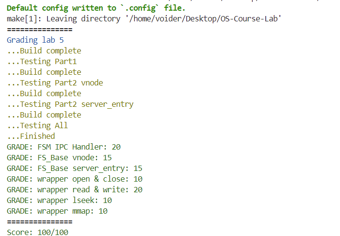

练习1：阅读 user/chcore-libc/libchcore/porting/overrides/src/chcore-port/file.c 的 chcore_openat 函数，分析 ChCore 是如何处理 openat 系统调用的，关注 IPC 的调用过程以及 IPC 请求的内容。

A: 
1. 首先在client端分配fd
2. 生成并解析文件路径，获取mount id
3. 调用get_ipc_struct_by_mount_id 获取 ipc_struct_t 结构，用于发送ipc，如果没有找到，则注册ipc client，得到ipc_struct_t结构
4. 设置fd record记录完整路径和mount id
5. 根据mounted_fs_ipc_struct创建ipc_msg，分配struct fs_request大小的ipc请求内存
6. 获取ipc_msg数据指针，并写入fr_request的相关信息，包括请求类型，fd，路径，flag，mode。
7. 调用ipc_call(mounted_fs_ipc_struct, ipc_msg)发送到服务端，并获取返回值，如果成功则在fd_dic记录fd的相关数据
8. 释放path与ipc_msg的内存
```C
int chcore_openat(int dirfd, const char *pathname, int flags, mode_t mode)
{
        struct fd_record_extension *fd_ext;
        struct fs_request *fr_ptr;
        ipc_struct_t *mounted_fs_ipc_struct;
        int ret;
        int mount_id;
        int fd;
        ipc_msg_t *ipc_msg;
        char *full_path;
        char server_path[FS_REQ_PATH_BUF_LEN];

        /*
         * Allocate a fd number first,
         * The fd will be send to fs_server to construct fd->fid mapping
         */
        if ((fd = alloc_fd()) < 0)
                return fd;

        /* Prepare full_path for IPC arguments, don't forget free(full_path) */
        ret = generate_full_path(dirfd, pathname, &full_path);
        if (ret)
                return ret;

        /* Send IPC to FSM and parse full_path */
        if (parse_full_path(full_path, &mount_id, server_path) != 0) {
                free(full_path);
                return -EINVAL;
        }

        /* Send IPC to fs_server */
        mounted_fs_ipc_struct = get_ipc_struct_by_mount_id(mount_id);
        // Fill fd record with IPC information */
        fd_ext = (struct fd_record_extension *)fd_dic[fd]->private_data;
        fd_ext->mount_id = mount_id;
        if (pathcpy(fd_ext->path, MAX_PATH_BUF_LEN, full_path, strlen(full_path))
            != 0) {
                free(full_path);
                return -EBADF;
        }
        ipc_msg = ipc_create_msg(
                mounted_fs_ipc_struct, sizeof(struct fs_request));
        fr_ptr = (struct fs_request *)ipc_get_msg_data(ipc_msg);

        fr_ptr->req = FS_REQ_OPEN;
        fr_ptr->open.new_fd = fd;
        if (pathcpy(fr_ptr->open.pathname,
                    FS_REQ_PATH_BUF_LEN,
                    server_path,
                    strlen(server_path))
            != 0) {
                ipc_destroy_msg(ipc_msg);
                free(full_path);
                return -EBADF;
        }
        fr_ptr->open.flags = flags;
        fr_ptr->open.mode = mode;

        ret = ipc_call(mounted_fs_ipc_struct, ipc_msg);

        if (ret >= 0) {
                fd_dic[fd]->type = FD_TYPE_FILE;
                fd_dic[fd]->fd_op = &file_ops;
                ret = fd; /* Return fd if succeed */
        } else {
                free_fd(fd);
        }

        free(full_path);
        ipc_destroy_msg(ipc_msg);

        return ret;
}
```

练习2：实现 user/system-services/system-servers/fsm/fsm.c 的 fsm_mount_fs 函数。

A:
注册IPC_client, 与文件系统fs_cap建立IPC连接
将返回值置为文件系统的fs_cap
```C
        /* Lab 5 TODO Begin */
        mp_node->_fs_ipc_struct = ipc_register_client(fs_cap);
        ret = fs_cap;
        // UNUSED(mp_node);
        /* Lab 5 TODO End */
```

练习3：实现 user/system-services/system-servers/fsm/fsm.c 的 IPC 请求处理函数。

A:
1. 完成fsm_set_client_cap，fsm_get_client_cap。在此处mount id被视为cap_table的下标 set时先检查client_badge对应的fsm_client_cap_node是否存在，如果存在则在iter->cap_table新添加cap，如果不存在，则新分配一个，添加cap // get时遍历fsm_client_cap_table检查client_badge的node是否存在，然后遍历cap_table检查cap是否存在
2. 实现FSM_REQ_PARSE_PATH。通过get_mount_point获得挂载点信息，调用fsm_get_client_cap检查mount id是否存在，如果不存在，则调用fsm_set_client_cap设置client_cap，填充fsm_req中空缺的信息，并设置ipc_return_cap；如果mount id存在则只需要填充fsm_req中空缺信息(mount id, path等)；最后设置返回值并返回。
```C
/* Return mount_id */
int fsm_set_client_cap(badge_t client_badge, cap_t cap)
{
        /* Lab 5 TODO Begin */
        struct fsm_client_cap_node *iter;
        bool findCap = false;
        int ret = 0;
        // pthread_mutex_lock(&fsm_client_cap_table_lock);
        for_each_in_list(iter, struct fsm_client_cap_node, node, &fsm_client_cap_table) {
                if (iter->client_badge == client_badge) {
                        findCap = true;
                        ret = iter->cap_num;
                        iter->cap_table[iter->cap_num] = cap;
                        iter->cap_num++;
                        break;
                }
        }
        if (!findCap) {
                struct fsm_client_cap_node *fc;
                fc = (struct fsm_client_cap_node *)malloc(sizeof(*fc));
                fc->cap_num = 1;
                fc->cap_table[0] = cap;
                fc->client_badge = client_badge;
                list_add(&fc->node, &fsm_client_cap_table);
                ret = 0;
        }
        // pthread_mutex_unlock(&fsm_client_cap_table_lock);
        /* Lab 5 TODO End */
        return ret;
}

/* Return mount_id if record exists, otherwise -1 */
int fsm_get_client_cap(badge_t client_badge, cap_t cap)
{
        /* Lab 5 TODO Begin */
        int ret = -1;
        // pthread_mutex_lock(&fsm_client_cap_table_lock);
        struct fsm_client_cap_node *iter;
        for_each_in_list(iter, struct fsm_client_cap_node, node, &fsm_client_cap_table) {
                if (iter->client_badge == client_badge) {
                        for (int i = 0; i < iter->cap_num; i++) {
                                if (cap == iter->cap_table[i]) {
                                        ret = i;
                                        break;
                                }
                        }
                        if (ret != -1) {
                                break;
                        }
                }
        }
        // pthread_mutex_unlock(&fsm_client_cap_table_lock);
        /* Lab 5 TODO End */
        return ret;
}


        case FSM_REQ_PARSE_PATH: {
                /* Lab 5 TODO Begin */
                mpinfo = get_mount_point(fsm_req->path, strlen(fsm_req->path));

                pthread_mutex_lock(&fsm_client_cap_table_lock);
                mount_id = fsm_get_client_cap(client_badge, mpinfo->fs_cap);
                pthread_mutex_unlock(&fsm_client_cap_table_lock);

                if (mount_id == -1) {
                        ret_with_cap = true;
                        fsm_req->new_cap_flag = true;

                        pthread_mutex_lock(&fsm_client_cap_table_lock);
                        mount_id = fsm_set_client_cap(client_badge, mpinfo->fs_cap);
                        pthread_mutex_unlock(&fsm_client_cap_table_lock);

                        fsm_req->mount_id = mount_id;
                        // fsm_req->mount_path_len = mpinfo->path_len;
                        strncpy(fsm_req->mount_path, mpinfo->path, mpinfo->path_len);

                        ipc_set_msg_return_cap_num(ipc_msg, 1);
                        ipc_set_msg_cap(ipc_msg, 0, mpinfo->fs_cap);
                        ret = 1;
                } else {
                        fsm_req->mount_path_len = mpinfo->path_len;
                        fsm_req->new_cap_flag = false;
                        fsm_req->mount_id = mount_id;
                        strncpy(fsm_req->mount_path, mpinfo->path, mpinfo->path_len);
                }
                break;
                // UNUSED(mpinfo);
                // UNUSED(mount_id);
                
                /* Lab 5 TODO End */
        }
```

练习4：实现 user/system-services/system-servers/fs_base/fs_vnode.c 中 vnode 的 alloc_fs_vnode、get_fs_vnode_by_id、inc_ref_fs_vnode、dec_ref_fs_vnode函数。

A:
1. alloc_fs_vnode 分配并根据函数参数初始化vnode，需要注意还没有映射pmo，因此置为-1，初始化lock和page_cache
2. get_fs_vnode_by_id 首先完成比较函数cmp_key_node，负责比较key与node对应key的大小以确定rbtree寻找方向，首先调用rbsearch函数搜索node，最后调用rbentry获得vnode结构
3. inc_ref_fs_vnode 增加refcnt字段
4. dec_ref_fs_vnode 减少refcnt字段，如果引用为0，则pop该vnode
```C
static int cmp_key_node(const void *key, const struct rb_node *node)
{
        struct fs_vnode *sear = rb_entry(node, struct fs_vnode, node);
        ino_t t_k = *((ino_t *)key);
        if (t_k < sear->vnode_id)
                return -1;
        if (t_k > sear->vnode_id)
                return 1;
        return 0;
}

struct fs_vnode *alloc_fs_vnode(ino_t id, enum fs_vnode_type type, off_t size,
                                void *private)
{
        /* Lab 5 TODO Begin */
        struct fs_vnode *ret = (struct fs_vnode *)malloc(sizeof(*ret));

        ret->vnode_id = id;
        ret->type = type;
        ret->size = size;
        ret->private = private;

        ret->refcnt = 1;
        ret->pmo_cap = -1;

        // init_rb_root(&ret->node);
        pthread_rwlock_init(&ret->rwlock, NULL);
        if (using_page_cache) {
                struct page_cache_entity_of_inode* cache = new_page_cache_entity_of_inode(id, private);
                if (cache != NULL) {
                        ret->page_cache = cache;
                }
        }
        return ret;

        /* Lab 5 TODO End */
}

struct fs_vnode *get_fs_vnode_by_id(ino_t vnode_id)
{
        /* Lab 5 TODO Begin */
        struct fs_vnode *ret = NULL;
        struct rb_node *rbnode = rb_search(fs_vnode_list, (void *)&vnode_id, cmp_key_node);
        if (rbnode == NULL) {
                return NULL;
        }
        ret = rb_entry(rbnode, struct fs_vnode, node);
        return ret;
        /* Lab 5 TODO End */
}

/* increase refcnt for vnode */
int inc_ref_fs_vnode(void *n)
{
        /* Lab 5 TODO Begin */
        if (n == NULL) {
                return 0;
        }
        struct fs_vnode *vnode = (struct fs_vnode *)n;
        // pthread_rwlock_wrlock(&vnode->rwlock);
        vnode->refcnt++;
        // pthread_rwlock_unlock(&vnode->rwlock);
        /* Lab 5 TODO End */
        return 0;
}

/* decrease vnode ref count and close file when refcnt is 0 */
int dec_ref_fs_vnode(void *node)
{
        /* Lab 5 TODO Begin */

        if (node == NULL) {
                return 0;
        }

        struct fs_vnode *vnode = (struct fs_vnode *)node;
        // pthread_rwlock_wrlock(&vnode->rwlock);
        vnode->refcnt--;
        if (vnode->refcnt == 0) {
                pop_free_fs_vnode(vnode);
        }
        // pthread_rwlock_unlock(&vnode->rwlock);
        // UNUSED(node);
        
        /* Lab 5 TODO End */

        return 0;
}
```

练习5：实现 user/system-services/system-servers/fs_base/fs_wrapper.c 中的 fs_wrapper_set_server_entry 和 fs_wrapper_get_server_entry 函数。

A:
1. fs_wrapper_get_server_entry 填充代码部分为遍历server_entry_mapping并返回fd_to_fid[fd]
2. fs_wrapper_set_server_entry 首先遍历server_entry_mapping查询client_badge对应的node是否存在，如果存在则直接设置fd_to_fid[fd]；如果不存在则分配server_entry_node，设置fd_to_fid[fd]之后将node加入server_entry_mapping
```C
/* Get (client_badge, fd) -> fid(server_entry) mapping */
int fs_wrapper_get_server_entry(badge_t client_badge, int fd)
{
        struct server_entry_node *n;

        /* Stable fd number, need no translating */
        if (fd == AT_FDROOT)
                return AT_FDROOT;

        /* Validate fd */
        if (fd < 0 || fd >= MAX_SERVER_ENTRY_PER_CLIENT) {
                return -1;
        }

        /* Lab 5 TODO Begin */

        for_each_in_list(n, struct server_entry_node, node, &server_entry_mapping) {
                if (n->client_badge == client_badge)
                        return n->fd_to_fid[fd];
        }
        // UNUSED(n);

        /* Lab 5 TODO End */
        return -1;
}

/* Set (client_badge, fd) -> fid(server_entry) mapping */
int fs_wrapper_set_server_entry(badge_t client_badge, int fd, int fid)
{
        struct server_entry_node *private_iter;

        /* Validate fd */
        BUG_ON(fd < 0 || fd >= MAX_SERVER_ENTRY_PER_CLIENT);

        /* Lab 5 TODO Begin */
        for_each_in_list(private_iter, struct server_entry_node, node, &server_entry_mapping) {
                if (private_iter->client_badge == client_badge) {
                        private_iter->fd_to_fid[fd] = fid;
                        return 0;
                }
        }
        /* 
         * Check if client_badge already involved, 
         * create new server_entry_node if not.
         */

        struct server_entry_node *n = (struct server_entry_node *)malloc(sizeof(*n));
        n->client_badge = client_badge;
        for (int i = 0; i < MAX_SERVER_ENTRY_PER_CLIENT; i++)
                n->fd_to_fid[i] = -1;
        // UNUSED(private_iter);
        n->fd_to_fid[fd] = fid;
        list_append(&n->node, &server_entry_mapping);
        /* Lab 5 TODO End */
        return 0;
}
```

练习6：实现 user/system-services/system-servers/fs_base/fs_wrapper_ops.c 中的 fs_wrapper_open、fs_wrapper_close、fs_wrapper_read、fs_wrapper_pread、fs_wrapper_write、fs_wrapper_pwrite、fs_wrapper_lseek、fs_wrapper_fmap 函数。

A:
1. fs_wrapper_open 根据函数参数调用server_ops.open函数，之后分配server_entry，分配失败则close并返回；通过open函数得到的vnodeid获取vnode如果vnode存在则增加引用技术，并调用assign_entry初始化server_entry; 如果不存在则分配vnode，初始化server_entry，调用fs_wrapper_set_server_entry记录fd到fid的映射，返回fd。
2. fs_wrapper_close 获取fid并验证是否合法；找到vnode，根据vnode和server_entrys[fd]的引用计数确定是否关闭，如果server_entrys[fd]->refcnt == 0则清除对应的entry并减少vnode的refcnt；
3. fs_wrapper_read 从vnode和fr_req信息中获得offset count size等参数，判读读取内容是否越界，调整读取内容大小，调用server_ops.read并调整offset，返回读取内容长度
4. fs_wrapper_pread 从fr_req中获取offset大小和读取内容size，与vnode->size进行比较，调整读取内容大小，调用server_ops.read从指定offset读取，最后不更新offset，返回读取内容长度
5. fs_wrapper_pread 首先比较offset与vnode size大小；在offset位置写入指定大小的内容，判断是否更新size；不更新文件原本的offset，返回写入的数据量
6. fs_wrapper_write 首先比较写入大小与0；在文件offset写入指定大小的内容，更新文件offset并根据offset与写入大小来更新文件大小，返回写入内容大小
7. fs_wrapper_lseek 判断lseek类型SEEK_SET 直接指定offset；SEEK_CUR在当前file cursor加上offset；SEEK_END在文件末尾 + offset；更新server_entry的offset并设置fr_req中的返回值为offset
8. fs_wrapper_fmap 填充的部分为 调用fmap_area_insert创建新的fmap_area_mapping记录 如果vnode没有存在pmo则分配vnode size对应的pmo；设置ipc返回的pmo cap。
```C
int fs_wrapper_open(badge_t client_badge, ipc_msg_t *ipc_msg,
                    struct fs_request *fr)
{
        /* Lab 5 TODO Begin */

        /*
         * Hint:
         *   1. alloc new server_entry
         *   2. get/alloc vnode
         *   3. associate server_entry with vnode
         */
        int return_fd;
        char *path;
        int flag;
        int mode;
        int entry_id;
        int ret;

        ino_t vnode_id;
        int vnode_type;
        void *private;

        struct fs_vnode *vnode;

        off_t vnode_size;

        return_fd = fr->open.new_fd;
        path = fr->open.pathname;
        flag = fr->open.flags;
        mode = fr->open.mode; 

        ret = server_ops.open(path, flag, mode, &vnode_id, &vnode_size, &vnode_type, &private);

        if (ret != 0) {
                fs_debug_error("ret = %d\n", ret);
                return ret;
        }

        entry_id = alloc_entry();
        if (entry_id < 0) {
                server_ops.close(private, (vnode_type == FS_NODE_DIR), true);
                return -EMFILE;
        }

        vnode = get_fs_vnode_by_id(vnode_id);
        if (vnode != NULL) {
                inc_ref_fs_vnode(vnode);
                assign_entry(server_entrys[entry_id], flag, 0, 1, (void *)strdup(path), vnode);
        } else {
                vnode = alloc_fs_vnode(vnode_id, vnode_type, vnode_size, private);
                push_fs_vnode(vnode);
                assign_entry(server_entrys[entry_id], flag, 0, 1, (void *)strdup(path), vnode);
        }

        fs_wrapper_set_server_entry(client_badge, return_fd, entry_id);
        
        return return_fd;

        /* Lab 5 TODO End */
}

int fs_wrapper_close(badge_t client_badge, ipc_msg_t *ipc_msg,
                     struct fs_request *fr)
{
        /* Lab 5 TODO Begin */
        int fd;
        struct fs_vnode *vnode;
        int ret;

        ret = 0;
        fd = fr->close.fd;
        if (fd_type_invalid(fd, true) && fd_type_invalid(fd, false)) {
                return -ENOENT;
        }

        vnode = server_entrys[fd]->vnode;

        if (server_entrys[fd]->vnode->refcnt - 1 > 1) {
                return 0;
        }

        server_entrys[fd]->refcnt -= 1;

        ret = server_ops.close(vnode->private, (vnode->type == FS_NODE_DIR), false);

        if (server_entrys[fd]->refcnt == 0) {
                free_entry(fd);

                fs_wrapper_clear_server_entry(client_badge, fd);

                dec_ref_fs_vnode(vnode);
        }       
        return ret;
        /* Lab 5 TODO End */
}

int fs_wrapper_read(ipc_msg_t *ipc_msg, struct fs_request *fr)
{
        /* Lab 5 TODO Begin */
        int fd;
        char *buf;
        unsigned long long offset;
        size_t size;
        void *operator;
        int ret;
        struct fs_vnode *vnode;

        ret = 0;
        fd = fr->read.fd;
        buf = (void *)fr;

        size = (size_t)fr->read.count;

        // pthread_mutex_lock(&server_entrys[fd]->lock);
        offset = (unsigned long long)server_entrys[fd]->offset;
        vnode = server_entrys[fd]->vnode;
        operator = vnode->private;

        if (offset >= server_entrys[fd]->vnode->size) {
                // pthread_mutex_unlock(&server_entrys[fd]->lock);
                return 0;
        }

        if (offset + size > vnode->size) {
                size = vnode->size - offset;
        }

        // pthread_rwlock_rdlock(&vnode->rwlock);
        ret = server_ops.read(operator, offset, size, buf);
        // pthread_rwlock_unlock(&vnode->rwlock);

        server_entrys[fd]->offset += ret;

        // pthread_mutex_unlock(&server_entrys[fd]->lock);

        return ret;
        /* Lab 5 TODO End */
}

int fs_wrapper_pread(ipc_msg_t *ipc_msg, struct fs_request *fr)
{
        /* Lab 5 TODO Begin (OPTIONAL) */
        int fd;
        char *buf;
        unsigned long long offset;
        size_t size;
        void *operator;
        int ret;
        struct fs_vnode* vnode;

        ret = 0;
        fd = fr->pread.fd;
        offset = (unsigned long long)fr->pread.offset;
        size = (size_t)fr->pread.count;
        vnode = server_entrys[fd]->vnode;
        operator = vnode->private;
        buf = (void *)fr;

        if (offset >= vnode->size) {
                return 0;
        }

        if (offset + size > vnode->size) {
                size = vnode->size - offset;
        }

        // pthread_rwlock_rdlock(&vnode->rwlock);
        ret = server_ops.read(operator, offset, size, buf);
        // pthread_rwlock_unlock(&vnode->rwlock);
        return ret;
        /* Lab 5 TODO End (OPTIONAL) */
}

int fs_wrapper_pwrite(ipc_msg_t *ipc_msg, struct fs_request *fr)
{
        /* Lab 5 TODO Begin (OPTIONAL) */
        int fd;
        char *buf;
        size_t size;
        unsigned long long offset;
        void *operator;
	int ret;

        ret = 0;
        fd = fr->pwrite.fd;
        buf = (void *)fr + sizeof(struct fs_request);
        size = (size_t)fr->pwrite.count;
        offset = (unsigned long long)fr->pwrite.count;
        operator = server_entrys[fd]->vnode->private;

        if (size == 0) {
                return 0;
        }

        if (offset > server_entrys[fd]->vnode->size) {
                return 0;
        }

        pthread_mutex_lock(&server_entrys[fd]->lock);

        ret = server_ops.write(operator, offset, size, buf);

        if (offset + size > server_entrys[fd]->vnode->size) {
                server_entrys[fd]->vnode->size = offset + size;
        }

        pthread_mutex_unlock(&server_entrys[fd]->lock);

        return ret;
        /* Lab 5 TODO End (OPTIONAL) */
}

int fs_wrapper_write(ipc_msg_t *ipc_msg, struct fs_request *fr)
{
        /* Lab 5 TODO Begin */
        int fd;
        char *buf;
        size_t size;
        unsigned long long offset;
        void *operator;
	int ret;
	// struct fs_vnode *vnode;

        ret = 0;
        fd = fr->write.fd;
        buf = (void *)fr + sizeof(struct fs_request);
        size = (size_t)fr->write.count;
        offset = (unsigned long long)server_entrys[fd]->offset;
        // vnode = server_entrys[fd]->vnode;
        operator = server_entrys[fd]->vnode->private;

        if (size == 0) {
                return 0;
        }
        pthread_mutex_lock(&server_entrys[fd]->lock);

        ret = server_ops.write(operator, offset, size, buf);

        server_entrys[fd]->offset += ret;
        if (server_entrys[fd]->offset > server_entrys[fd]->vnode->size) {
                server_entrys[fd]->vnode->size = server_entrys[fd]->offset;
        }

        pthread_mutex_unlock(&server_entrys[fd]->lock);
        return ret;
        /* Lab 5 TODO End */
}

int fs_wrapper_lseek(ipc_msg_t *ipc_msg, struct fs_request *fr)
{
        /* Lab 5 TODO Begin */
        int fd;
        long long offset;
        int whence;
        long long target_off;

        fd = fr->lseek.fd;
        offset = fr->lseek.offset;
        whence = fr->lseek.whence;
        /* 
         * Hint: possible values of whence:
         *   SEEK_SET 0
         *   SEEK_CUR 1
         *   SEEK_END 2
         */
        
        switch (whence)
        {
        case SEEK_SET: {
                target_off = offset;
                break;
        }
        case SEEK_CUR: {
                target_off = server_entrys[fd]->offset + offset;
                break;
        }
        case SEEK_END: {
                target_off = server_entrys[fd]->vnode->size + offset;
                break;
        }
        default:
                target_off = -1;
                break;
        }

        if (target_off < 0) {
                return -EINVAL;
        }

        server_entrys[fd]->offset = target_off;
        fr->lseek.ret = target_off;

        return target_off;

        /* Lab 5 TODO End */
}

int fs_wrapper_fmap(badge_t client_badge, ipc_msg_t *ipc_msg,
                    struct fs_request *fr, bool *ret_with_cap)
{
        void *addr;
        size_t length;
        int prot;
        int flags;
        int fd;
        off_t offset;
        struct fs_vnode *vnode;
        cap_t pmo_cap;
        int ret;

        /* If there is no valid fmap implementation, return -EINVAL */
        if (!using_page_cache
            && server_ops.fmap_get_page_addr == default_fmap_get_page_addr) {
                fs_debug_error("fmap is not impl.\n");
                return -EINVAL;
        }

        /* Step: Parsing arguments in fr */
        addr = (void *)fr->mmap.addr;
        length = (size_t)fr->mmap.length;
        prot = fr->mmap.prot;
        flags = fr->mmap.flags;
        fd = fr->mmap.fd;
        offset = (off_t)fr->mmap.offset;

        vnode = server_entrys[fd]->vnode;
        fs_debug_trace_fswrapper(
                "addr=0x%lx, length=0x%lx, prot=%d, flags=%d, fd=%d, offset=0x%lx\n",
                (u64)addr,
                length,
                prot,
                flags,
                fd,
                offset);

        /* Sanity Check for arguments */
        if (prot & (~(PROT_NONE | PROT_READ | PROT_WRITE | PROT_EXEC))) {
                return -EINVAL;
        }

        if (flags & MAP_ANONYMOUS) {
                return -EINVAL;
        }

        if (flags & (~(MAP_SHARED | MAP_PRIVATE | MAP_FIXED_NOREPLACE))) {
                fs_debug_trace_fswrapper("unsupported flags=%d\n", flags);
                return -EINVAL;
        }

        if (length % PAGE_SIZE) {
                length = ROUND_UP(length, PAGE_SIZE);
        }
        // UNUSED(addr);
        // UNUSED(fd);
        // UNUSED(offset);

        ret = fmap_area_insert(client_badge, (vaddr_t)addr, length, vnode, offset, flags, prot);
        if (ret < 0) {
                return ret;
        }

        if (vnode->pmo_cap == -1) {
                pmo_cap = usys_create_pmo(vnode->size, PMO_FILE);
                if (pmo_cap < 0) {
                        ret = fmap_area_remove(client_badge, (vaddr_t)addr, length);
                        return ret;
                }
                vnode->pmo_cap = pmo_cap;
        }

        *ret_with_cap = true;
        ipc_set_msg_return_cap_num(ipc_msg, 1);
        ipc_set_msg_cap(ipc_msg, 0, vnode->pmo_cap);

        /* Lab 5 TODO Begin */
        // UNUSED(pmo_cap);
        // UNUSED(vnode);
        // UNUSED(ret);
        return 0;
        /* Lab 5 TODO End */
}
```

练习7：思考 ChCore 当前实现 VFS 的方式有何利弊？如果让你在微内核操作系统上实现 VFS 抽象，你会如何实现？

pro：将文件系统放入用户态运行，减少内核负担，且在VFS崩溃时不会使内核也一起崩溃
cons：对文件(文件系统)的操作基本上通过IPC来完成，增加了很多性能开销

实现：将fsm部分放入内核来运行，对于文件系统的挂载等操作通过syscall来完成，对于文件路径的解析也在内核中的fsm实现，这样可以减少IPC引起的多次内核陷入，解析完路径之后再通过IPC与文件系统进行通信；此时也可以将page cache的管理放入内核fsm中，每次读写时可以通过syscall来维护缓存，实现不同文件系统page cache的共享。

#### 运行结果
